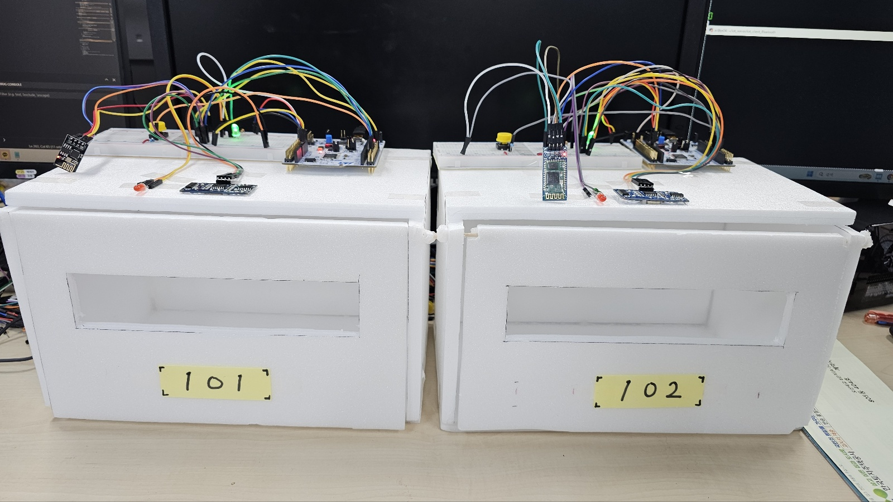
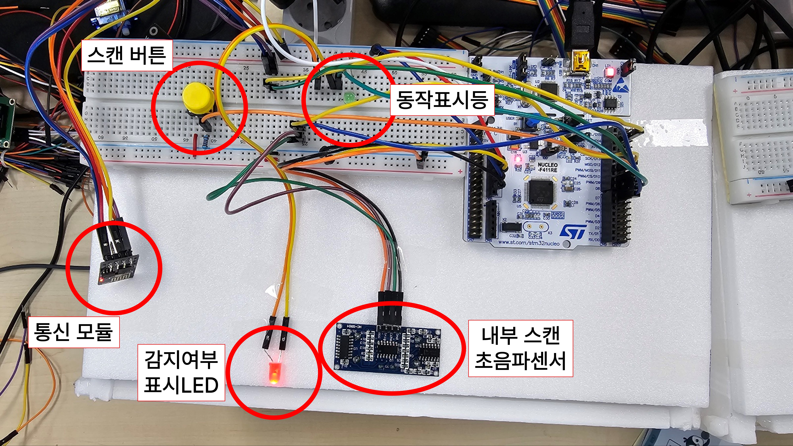
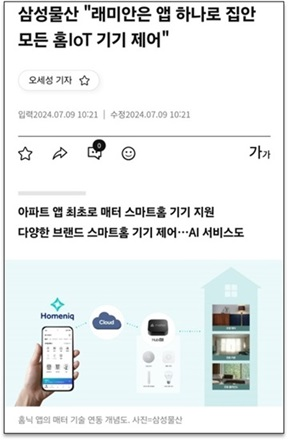
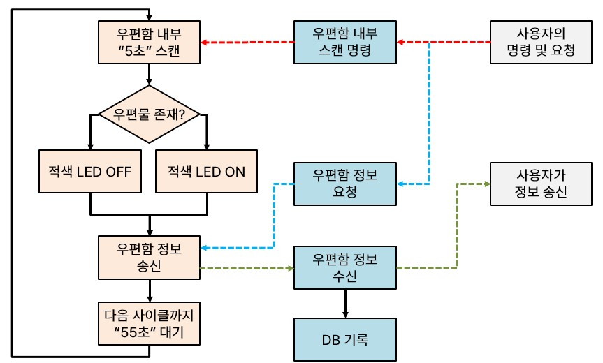

# IoT 우편함
        

## 프로젝트 의의
- ***C언어*** 이해와 지식을 바탕으로 코드를 작성
- ***STM32 Nucleo F401RE*** 보드와 ***HAL 드라이버***를 활용한 아이템 구현현
- ***라즈베리파이***를 활용하여 ***IoT 서버와 시스템***을 구현
- ***소켓 통신***을 통해 서버와 STM32 보드간 데이터를 송수신

---

## 상세
### 🔖 배경 및 계계획
#### 배경
1) 대기업들이 앞다투어 앱 하나로 집안에 있는 모든 홈 IoT기기를 제어 가능토록 확장 중
2) 스마트홈 기기 제어와 거기에 AI 서비스까지 확장
3) 이러한 추세로 스마트홈을 넘어 스마트 시티로 나아가고 있는 AIoT 시장
4) 아직까지는 우편물을 주고받는 부분에 대해서는 IoT로의 연결이 미흡
5) 이에 우편함까지도 IoT에 융합해보고자 해당 프로젝트를 기획
#### 계획
1) 사람이 직접 가서 육안으로 확인하는 **번거로움**과 **물리적 제약 해소**
2) 센서, LED, 유무선 네트워크 등을 활용하여 우편물 여부 **스마트**하게 **확인**
3) 기존의 우편함도 **개선** & 기존의 홈 시스템에 **병합**  
  
### 🗓️ 작업기간
- 24/11/20 ~ 24/11/27
### 🌐 개발환경
- **STM32 작업 :** Window11, STM32CubeIDE 1.16.1, C언어
- **IoT 서버 작업 :** Ubuntu 20.04 Linux, vi, SSH & VS Code, 라즈베리파이 4B
### 💻 시스템 구성도

**1. 우편함**  
  - STM32-F411RE , 우편함 제어 클라이언트
  - Timer2
    - 1초 클럭 생성용 / Internal Clock Source / TIM2 global interrupt 활성화
    - Prescaler : 8400-1 / Counter Period : 10000-1
  - Timer3
    - 초음파센서 제어용 / Internal Clock Source / TIM3 global interrupt 활성화
    - CH1 : Input Capture direct mode / Prescaler : 84-1 / Counter Period : 0xffff-1
    - 초음파센서 Echo핀의 Input Capture용도 (PA6)
  - 입력
    - 택트 스위치 : 우편함 내부 검사 버튼 / GPIO EXTI 6 (PB6)
  - 출력
    - 적색 LED : 우편물 존재여부 표시기 / GPIO Output (PC10)
    - 녹색 LED : 우편물 디바이스 동작 표시등 / GPIO Output (PA9)
    - 초음파센서 : Trig핀에 10us 간격으로 시그널 주입 / GPIO Output (PA8)

 

**2. 파이 서버**  
  - Raspberry Pi 4B , IoT 서버
  - 네트워크 연결 방식 : Wi-Fi (TCP/IP Socket 통신 적용) , Bluetooth
  - Mutex 기반에 멀티스레드 적용, 다수의 우편함 클라이언트 연결
  - 역할
    - 하위에 클라이언트로 연결된 다수의 우편함들이 보내는 정보 수신
    - 안드로이드 앱을 통해 혹은 서버를 직접 제어하여 관리자가 서버 및 클라이언트 관리
    - 일반 사용자(우편함 주인)에게 와이파이 통신을 통해 우편물 수신 푸쉬 메시지 송신

### 📝 동작 흐름

※ 우편함 동작 중 큰 따옴표(" ") 부분의 시간은 데모를 위해 값을 낮췄으나, 각각 '10초', '30분'을
기본값으로 구상하였음

### 🎞️ 동작 영상
※ 데모 영상에서는 버튼조작을 직접하나, 일정시간 간격으로 우편물 존재여부를 자동감지 실시함
#### 원격 동작 (구글드라이브) 🔉
<a href="https://drive.google.com/file/d/1WZRM_kQ3TF6mxDehBk09ZbYVVZobOVmb/view?usp=drive_link" target="_blank">https://drive.google.com/file/d/1WZRM_kQ3TF6mxDehBk09ZbYVVZobOVmb/view?usp=drive_link</a>

#### 로컬 동작 (구글드라이브) 🔉
<a href="https://drive.google.com/file/d/1HGgsrP95V_-FOTR3NZHVNyed21frwPQ2/view?usp=drive_link" target="_blank">https://drive.google.com/file/d/1HGgsrP95V_-FOTR3NZHVNyed21frwPQ2/view?usp=drive_link</a>

